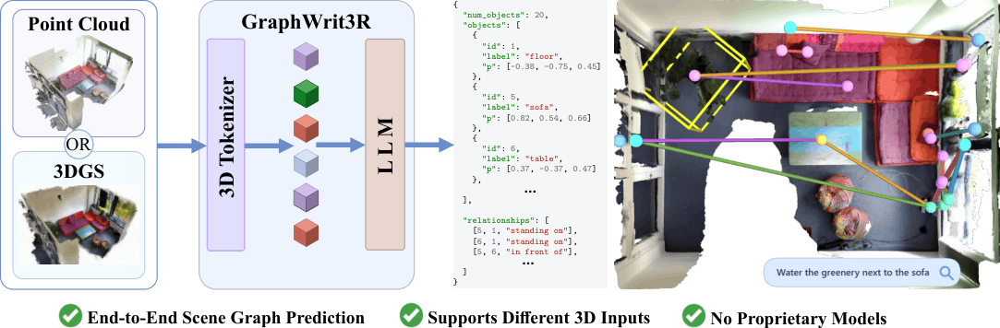

# ✍️ GraphWrit3R: End-to-End 3D Scene Graph Writing

[**Luka Milivojevic**](https://www.linkedin.com/in/luka-milivojevic)<sup>1</sup>,
[**Nikola Popovic**](https://nikolapopovic.com)<sup>1,†</sup>,
[**Sayan Deb Sarkar**](https://sayands.github.io/)<sup>2</sup>,
[**Sebastian Koch**](https://kochsebastian.com/)<sup>3</sup>,
[**Iro Armeni**](https://ir0.github.io/)<sup>2</sup>,
[**Luc Van Gool**](https://insait.ai/prof-luc-van-gool/)<sup>1</sup>,
[**Danda Pani Paudel**](https://insait.ai/dr-danda-paudel/)<sup>1</sup>

<sup>1</sup>INSAIT, Sofia University "St. Kliment Ohridski"  
<sup>2</sup>Stanford University  
<sup>3</sup>Ulm University  
<sup>†</sup>Project lead

<p align="center">
  
</p>

## TL;DR

- End-to-end 3D scene graph generation as structured JSON.
- Supports point clouds, 3D Gaussian Splats, or both.
- No ground-truth object annotations required at inference time.
- Open-vocabulary querying over predicted scene graphs.
- No proprietary model dependencies.

## Abstract

3D scene graphs provide a structured representation of complex environments by encoding objects, their semantic attributes, and the spatial and functional relationships between them. Current approaches for 3D scene graph generation suffer from several fundamental limitations. They rely on complex multi-stage pipelines with explicit intermediate representations, making systems fragile and prone to error propagation. They assume access to ground-truth object annotations during inference, which deviates from real-world scenarios. They depend on proprietary models, hindering open-source deployment, or incur prohibitively slow inference.

We present **GraphWrit3R**, a simple end-to-end method that takes a 3D point cloud, Gaussian Splats, or a combination of both as input, and directly outputs a complete scene graph as a structured JSON script. The graph lists all objects, their semantic attributes, and the relationships between them, while avoiding the limitations above. Point cloud inputs are encoded via **Sonata** and Gaussian Splat inputs via **Chorus**, with both modalities projected onto a shared voxel grid and fused through a per-voxel contrastive alignment loss before being decoded by a large language model. As a natural consequence of the language-model decoder, GraphWrit3R also supports open-vocabulary querying.

## Installation

The code has been tested with:

- Ubuntu 22.04 LTS
- Python 3.11
- CUDA 12.4
- PyTorch 2.4.1

An NVIDIA GPU with sufficient memory is required for training.

### 1. Create the environment

```bash
conda create -y -n graphwrit3r python=3.11
conda activate graphwrit3r
```

Install PyTorch with a CUDA version compatible with your system. For CUDA 12.4:

```bash
pip install \
  torch==2.4.1+cu124 \
  torchvision==0.19.1+cu124 \
  torchaudio==2.4.1+cu124 \
  --index-url https://download.pytorch.org/whl/cu124
```

If your system does not provide a CUDA toolkit for building extensions:

```bash
conda install -y -c nvidia/label/cuda-12.4.1 \
  cuda=12.4 \
  cuda-toolkit=12.4 \
  cuda-nvcc=12.4 \
  cuda-compiler=12.4 \
  cuda-cudart=12.4
```

Install build tools:

```bash
conda install -y -c conda-forge \
  gcc=13.2 \
  gxx=13.2 \
  ninja \
  cmake \
  git \
  wget \
  sparsehash
```

When using a Conda-provided CUDA toolkit:

```bash
export CUDA_HOME="$CONDA_PREFIX"
export PATH="$CUDA_HOME/bin:$PATH"
export LD_LIBRARY_PATH="$CONDA_PREFIX/lib:$CONDA_PREFIX/lib64:${LD_LIBRARY_PATH:-}"
```

For Hopper GPUs such as H100/H200, set:

```bash
export TORCH_CUDA_ARCH_LIST="9.0"
```

For other GPUs, set the corresponding CUDA compute capability before compiling custom CUDA extensions.

### 2. Install GraphWrit3R

From the repository root:

```bash
pip install poetry
poetry config virtualenvs.create false --local
poetry install
poe install-training
```

Install FlashAttention:

```bash
pip install flash-attn --no-build-isolation --no-cache-dir
```

Install PyTorch Geometric packages compatible with PyTorch 2.4 and CUDA 12.4:

```bash
pip install \
  --find-links https://data.pyg.org/whl/torch-2.4.0+cu124.html \
  torch-scatter \
  torch-sparse \
  torch-cluster \
  torch-geometric
```

Install `spconv`:

```bash
pip install spconv-cu124
```

Install the remaining dependencies:

```bash
pip install \
  ftfy regex tqdm h5py pyyaml plyfile==1.1 termcolor \
  black yapf numba matplotlib sharedarray timm \
  peft==0.17.1 huggingface_hub==0.34.4 \
  umap-learn==0.5.9.post2 wandb tensorboard tensorboardx
```

Install CLIP and OCNN:

```bash
pip install --no-deps git+https://github.com/openai/CLIP.git

pip install \
  git+https://github.com/octree-nn/ocnn-pytorch.git \
  --no-deps \
  --no-build-isolation
```


## Data

GraphWrit3R uses external datasets and checkpoints that must be downloaded separately. Please follow the licenses and terms of use of the original data providers.

| Input | Source | Expected layout |
| --- | --- | --- |
| SceneVerse 3RScan point clouds | [SceneVerse](https://scene-verse.github.io/) | `$SCENEVERSE_SCAN_DATA_ROOT/pcd_with_global_alignment/<scan_id>.pth` |
| 3DSSG metadata and subset splits | [3DSSG subset data](https://github.com/3DSSG/3DSSG.github.io/#subset-data) | `$DATA_3DSSG_ROOT/objects.json`, `$DATA_3DSSG_ROOT/relationships.json`, `$DATA_3DSSG_SUBSET_ROOT/relationships_{train,validation}.json` |
| 3RScan raw scans | [3RScan toolkit](https://github.com/WaldJohannaU/3RScan) | `$R3SCAN_ROOT/<scan_id>/mesh.refined.v2.obj`, `$R3SCAN_ROOT/<scan_id>/semseg.v2.json` |
| 3RScan 3DGS data | [GaussianWorld/3rscan_mcmc_3dgs](https://huggingface.co/datasets/GaussianWorld/3rscan_mcmc_3dgs/tree/main) | `$RAW_3DGS_ROOT/<scan_id>/ckpts/point_cloud_30000.ply` |
| Chorus checkpoint | [SceneSplatPro/chorus](https://huggingface.co/SceneSplatPro/chorus) | `$CHORUS_CKPT_DIR/lang-dino-enc-pretrain-scan-ppv2-mp3d-mcmc.pth` |

The 3DGS data is distributed separately from this repository. Access may require accepting the corresponding dataset terms on Hugging Face.

### Configure paths

Choose a data directory and export the paths used below:

```bash
export GRAPHWRIT3R_ROOT="$(pwd)"
export DATA_ROOT="$GRAPHWRIT3R_ROOT/data"

export DATA_3DSSG_ROOT="$DATA_ROOT/3DSSG"
export DATA_3DSSG_SUBSET_ROOT="$DATA_ROOT/3DSSG_subset"
export SCENEVERSE_SCAN_DATA_ROOT="$DATA_ROOT/sceneverse_3rscan/3RScan/scan_data"
export R3SCAN_ROOT="$DATA_ROOT/3RScan"
export RAW_3DGS_ROOT="$DATA_ROOT/3rscan_mcmc_3dgs"

export FULL_SCENE_GRAPH_ROOT="$DATA_ROOT/graphwrit3r_full_scene_graphs"
export PCD_DATASET_ROOT="$DATA_ROOT/graphwrit3r_3dssg_subset"
export INTERMEDIATE_3DGS_ROOT="$DATA_ROOT/graphwrit3r_3dgs_intermediate"
export PREPARED_3DGS_ROOT="$DATA_ROOT/graphwrit3r_prepared_3dgs"
export FINAL_DATASET_ROOT="$DATA_ROOT/graphwrit3r_scene_graphs"
export CHORUS_CKPT_DIR="$DATA_ROOT/chorus_ckpt"

cd "$GRAPHWRIT3R_ROOT"
```

Download the Chorus checkpoint when initializing fusion from the base Chorus/SpatialLM checkpoint:

```bash
mkdir -p "$CHORUS_CKPT_DIR"

huggingface-cli download SceneSplatPro/chorus \
  lang-dino-enc-pretrain-scan-ppv2-mp3d-mcmc.pth \
  --local-dir "$CHORUS_CKPT_DIR"
```

## Dataset Preparation

### 1. Prepare point clouds

Compute 3DSSG object boxes from SceneVerse-aligned 3RScan point clouds:

```bash
python scripts/extract_3dssg_obbs.py \
  --objects_json "$DATA_3DSSG_ROOT/objects.json" \
  --relationships_json "$DATA_3DSSG_ROOT/relationships.json" \
  --pcd_root "$SCENEVERSE_SCAN_DATA_ROOT" \
  --output_dir "$FULL_SCENE_GRAPH_ROOT"
```

Create the 3DSSG-subset point-cloud dataset:

```bash
python scripts/extract_3dssg_subset.py \
  --subset_dir "$DATA_3DSSG_SUBSET_ROOT" \
  --scene_graph_dir "$FULL_SCENE_GRAPH_ROOT" \
  --pcd_root "$SCENEVERSE_SCAN_DATA_ROOT" \
  --output_dir "$PCD_DATASET_ROOT"
```

Expected output:

```text
$PCD_DATASET_ROOT/
├── pcd/
│   └── <scan_id>_split<split_num>.ply
├── scene_graph_train.json
├── scene_graph_val.json
└── dataset_info.json
```

### 2. Preprocess 3D Gaussian Splats

Preprocess the downloaded 3RScan 3DGS data:

```bash
python scripts/prepare_chorus_sonata_raw_bridge_subsets_parallel.py \
  --dataset-root "$PCD_DATASET_ROOT" \
  --chorus-root "$RAW_3DGS_ROOT" \
  --r3scan-root "$R3SCAN_ROOT" \
  --output-root "$INTERMEDIATE_3DGS_ROOT" \
  --splits train,val \
  --workers 4 \
  --match-radius-voxels 2
```

Create the final 3DGS representation used during training:

```bash
python scripts/prepare_native_chorus_cache_from_raw_bridge.py \
  --raw-bridge-root "$INTERMEDIATE_3DGS_ROOT" \
  --output-root "$PREPARED_3DGS_ROOT" \
  --splits train,val \
  --workers 4 \
  --native-match-radius 2 \
  --crop-mode radius \
  --crop-margin-meters 0.25
```

Expected output:

```text
$PREPARED_3DGS_ROOT/
├── train/
│   └── <scan_id>_split<split_num>/
│       ├── coord.npy
│       ├── color.npy
│       ├── opacity.npy
│       ├── scale.npy
│       ├── quat.npy
│       ├── sonata_grid.npy
│       ├── raw_splat_indices.npy
│       └── summary.json
└── val/
    └── ...
```

Scenes without matching point clouds, 3DGS files, or 3RScan metadata are skipped during preprocessing.

### 3. Prepare scene graphs

Create the final dataset root used for training:

```bash
python scripts/build_spatiallm_chorus_fusion_dataset.py \
  --source-root "$PCD_DATASET_ROOT" \
  --output-root "$FINAL_DATASET_ROOT" \
  --aligned-root "$PREPARED_3DGS_ROOT" \
  --overwrite
```

Expected output:

```text
$FINAL_DATASET_ROOT/
├── pcd -> $PCD_DATASET_ROOT/pcd
├── scene_graph_train.json
├── scene_graph_val.json
└── dataset_info.json
```

## Training

Configuration files are provided in `configs/`. The main fields that need to be adapted to a local setup are:

```text
dataset_dir
output_dir
chorus_aligned_root
chorus_checkpoint
cache_dir  # optional
```

`chorus_repo_root` can remain `third_party/chorus` when commands are run from the GraphWrit3R repository root.

A minimal Chorus-fusion configuration looks like:

```yaml
dataset_dir: data/graphwrit3r_scene_graphs
dataset: scene_graph_train
eval_dataset: scene_graph_val

chorus_fusion_enabled: true
chorus_repo_root: third_party/chorus
chorus_config: chorus_3dgs
chorus_checkpoint: data/chorus_ckpt/lang-dino-enc-pretrain-scan-ppv2-mp3d-mcmc.pth
chorus_aligned_root: data/graphwrit3r_prepared_3dgs
chorus_input_mode: prepared
chorus_missing_policy: pcd
```

Set `chorus_checkpoint: null` only when `model_name_or_path` points to a GraphWrit3R checkpoint that already contains Chorus weights. When starting from a base SpatialLM/Qwen checkpoint and adding Chorus fusion for the first time, keep `chorus_checkpoint` set to the pretrained Chorus checkpoint.

Choose one of the provided configuration files and launch training:

```bash
CONFIG="configs/YOUR_CONFIG.yaml"
python train.py "$CONFIG"
```

For multi-GPU training on one node, set `NPROC_PER_NODE` to the number of GPUs:

```bash
NPROC_PER_NODE=8 \
python train.py "$CONFIG"
```

## Inference

GraphWrit3R supports scene-graph generation from point clouds, 3D Gaussian Splats, or their averaged fusion.

Set a trained checkpoint and an output directory:

```bash
export GRAPHWRIT3R_CKPT="$DATA_ROOT/checkpoints/graphwrit3r"
export INFERENCE_OUTPUT="$DATA_ROOT/graphwrit3r_inference"
```


### Point-cloud inference

```bash
python inference_scene_graph.py \
  --model_path "$GRAPHWRIT3R_CKPT" \
  --point_cloud "$FINAL_DATASET_ROOT/pcd" \
  --val_json "$FINAL_DATASET_ROOT/scene_graph_val.json" \
  --output "$INFERENCE_OUTPUT/pcd" \
  --chorus_fusion_mode pcd \
  --temperature 0.00001 \
  --top_p 1.0 \
  --top_k 1 \
  --max_new_tokens 8192
```

### 3DGS inference

```bash
python inference_scene_graph.py \
  --model_path "$GRAPHWRIT3R_CKPT" \
  --val_json "$FINAL_DATASET_ROOT/scene_graph_val.json" \
  --output "$INFERENCE_OUTPUT/3dgs" \
  --chorus_aligned_root "$PREPARED_3DGS_ROOT" \
  --chorus_fusion_mode chorus \
  --chorus_missing_policy error \
  --temperature 0.00001 \
  --top_p 1.0 \
  --top_k 1 \
  --max_new_tokens 8192
```

### Point-cloud + 3DGS fusion

```bash
python inference_scene_graph.py \
  --model_path "$GRAPHWRIT3R_CKPT" \
  --point_cloud "$FINAL_DATASET_ROOT/pcd" \
  --val_json "$FINAL_DATASET_ROOT/scene_graph_val.json" \
  --output "$INFERENCE_OUTPUT/avg" \
  --chorus_aligned_root "$PREPARED_3DGS_ROOT" \
  --chorus_fusion_mode avg \
  --temperature 0.00001 \
  --top_p 1.0 \
  --top_k 1 \
  --max_new_tokens 8192
```


## Evaluation

Evaluate generated scene graphs with:

```bash
python -m sg_eval.eval_scene_graph \
  --predictions "$INFERENCE_OUTPUT/pcd" \
  --ground_truth "$FINAL_DATASET_ROOT/scene_graph_val.json" \
  --dataset_dir "$FINAL_DATASET_ROOT" \
  --train_scene_graphs "$FINAL_DATASET_ROOT/scene_graph_train.json" \
  --val_scene_graphs "$FINAL_DATASET_ROOT/scene_graph_val.json"
```

Replace `"$INFERENCE_OUTPUT/pcd"` with the output directory for the inference mode being evaluated.

Prediction directories should contain files named `<scene_id>_sg.json`, which is the default output format of `inference_scene_graph.py`.

## Scene Graph Visualization

Install the optional visualization dependencies:

```bash
pip install pyviz3d pillow sentence-transformers
```

Choose a predicted scene graph and its scene ID:

```bash
export SCENE_ID="SCAN_ID_split1"
export GRAPH_JSON="$INFERENCE_OUTPUT/pcd/${SCENE_ID}_sg.json"
export VIZ_OUTPUT="$DATA_ROOT/scene_graph_viz"
```

Render the scene graph:

```bash
python scripts/visualize_3dssg_scene_graph_pyviz3d.py \
  --graph-json "$GRAPH_JSON" \
  --scene-id "$SCENE_ID" \
  --graph-kind predicted \
  --r3scan-root "$R3SCAN_ROOT" \
  --sceneverse-pcd-root "$SCENEVERSE_SCAN_DATA_ROOT" \
  --base-mode sceneverse_textured_mesh_points \
  --mesh-point-samples 1800000 \
  --mesh-point-size 9 \
  --paper-point-size 22 \
  --scene-top-trim-percent 10 \
  --paper-camera-fov 58 \
  --paper-camera-distance-scale 1.35 \
  --box-alpha 0.18 \
  --edge-width 0.012 \
  --edge-alpha 0.9 \
  --ui-mode paper_demo \
  --tour-duration 18 \
  --output-dir "$VIZ_OUTPUT" \
  --output-name "${SCENE_ID}_demo"
```

For static viewing, serve the generated viewer directory with a local HTTP server:

```bash
cd "$VIZ_OUTPUT/${SCENE_ID}_demo"
python -m http.server 6008
```

For live text querying:

```bash
python scripts/serve_scene_graph_query.py \
  --viewer-dir "$VIZ_OUTPUT/${SCENE_ID}_demo" \
  --host 127.0.0.1 \
  --port 6008
```

## Acknowledgements

This project builds on open-source research and codebases for 3D scene understanding, point-cloud representation learning, Gaussian Splatting, and language-model-based structured prediction.

We thank the authors and maintainers of 3DSSG, 3RScan, SceneVerse, Sonata, Chorus, SpatialLM, and related open-source projects.

## Citation

```bibtex
@article{milivojevic2026graphwrit3r,
  title   = {GraphWrit3R: End-to-End 3D Scene Graph Writing},
  author  = {Milivojevic, Luka and Popovic, Nikola and Deb Sarkar, Sayan and Koch, Sebastian and Armeni, Iro and Van Gool, Luc and Paudel, Danda Pani},
  journal = {40th Conference on Neural Information Processing Systems (NeurIPS 2026)},
  year    = {2026}
}
```
